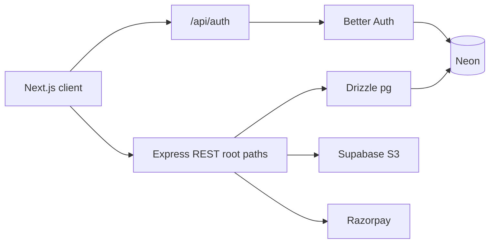

# Backend architecture (current)

## Stack

- **Runtime:** Bun
- **HTTP:** Express ([`backend/src/app.ts`](../backend/src/app.ts))
- **ORM:** Drizzle — schemas in [`backend/src/db/schema/`](../backend/src/db/schema/), relations in [`backend/src/db/relations.ts`](../backend/src/db/relations.ts)
- **Auth:** Better Auth 1.7.4 on Express at `/api/auth/*`
- **Storage:** Supabase S3-compatible API via [`StorageService`](../backend/src/storage/storage.service.ts)
- **Payments:** Razorpay

There is **no** Python/FastAPI backend in this repository.

## Request flow

## REST API (root paths)

| Method | Path |
|--------|------|
| GET | `/health` |
| GET | `/config/pricing` |
| GET | `/me`, `/me/print-jobs` |
| POST/GET/DELETE | `/files`, `/files/:id` |
| POST/GET/PATCH | `/print-jobs`, `/print-jobs/:id` |
| POST | `/print-jobs/:id/calculate-price`, `/release`, `/cancel` |
| POST | `/payments/create`, `/verify`, `/webhook` |
| GET/POST | `/kiosks/:token`, `/kiosks/:token/session` |

Success JSON: `{ "success": true, "data": ... }`

## Database

- **Better Auth:** CLI migration (`bun run auth:migrate` in `backend/`)
- **Application:** tables match legacy Alembic `001_initial` plus `kiosks.public_token`, optional `print_job_events.message`, indexes in `drizzle/0002_*.sql`

Payments use Razorpay-specific columns (`razorpay_order_id`, etc.) — provider abstraction is in the service layer, not a renamed DB schema.

## Kiosks

QR may use `public_token` or legacy `kiosk_code`. Release requires an active `kiosk_sessions` row for the user and kiosk.

## DOCX

[`DocumentConversionService`](../backend/src/files/document-conversion.service.ts) — stub until LibreOffice (or similar) is wired.

## Retention

`bun run retention:cleanup` in `backend/` — cron-ready, no Redis.

See [`backend/README.md`](../backend/README.md) for commands.
