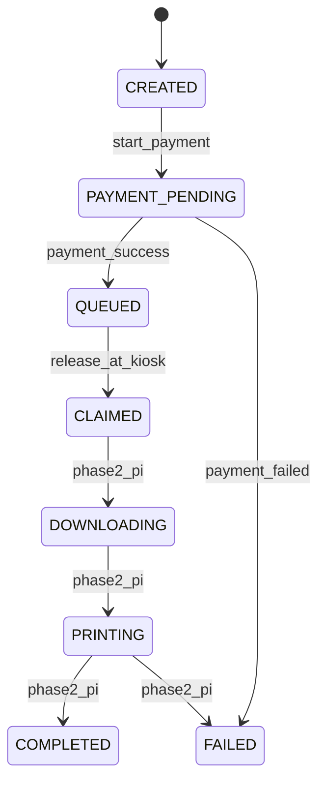

# Print Jobs

## Lifecycle

Phase 1 stops after `QUEUED` or `CLAIMED`.

## Events

`print_job_events` append-only timeline. Current status is on `print_jobs.status`.

## Print Settings (Phase 1)

| Setting | Values |
|---------|--------|
| copies | integer ≥ 1 |
| page_range | e.g. `1-5`, `1,3,5`, or `all` |
| color_mode | `BW` (UI); `COLOR` in model for future |
| paper_size | `A4` |
| duplex | `SINGLE`, `DOUBLE` |
| pages_per_sheet | 1, 2, 4, … |
| order | `NORMAL`, `REVERSE` |
| orientation | `AUTO`, `PORTRAIT`, `LANDSCAPE` |
| fit_to_page | boolean |

## Physical Sheet Pricing (authoritative)

1. Count pages in range ⊆ `[1, page_count]`.
2. Logical sheets per copy = `ceil(pages_in_range / pages_per_sheet)`.
3. Physical sheets per copy:
   - Single-sided: = logical sheets
   - Double-sided: `ceil(logical_sheets / 2)`
4. Total physical sheets = physical per copy × copies.
5. Price = physical sheets × rate(color_mode) from `pricing_rules`.

Rates default: B&W ₹2/sheet, Color ₹3/sheet (stored in paise: 200, 300).

## Saved Files

Optional “Save for 30 days” sets `save_file=true` and `file_retention_until=now+30d`. One saved file may back multiple print jobs. Reprint from History only when file still exists.

## Phase 2 Contract

After `POST /print-jobs/{id}/release`:

- Job has `kiosk_id`, status `CLAIMED`, events `KIOSK_SELECTED`, `PRINT_REQUESTED`.
- Pi agent polls or subscribes for jobs where `kiosk_id` matches and status is `CLAIMED`/`QUEUED`.
