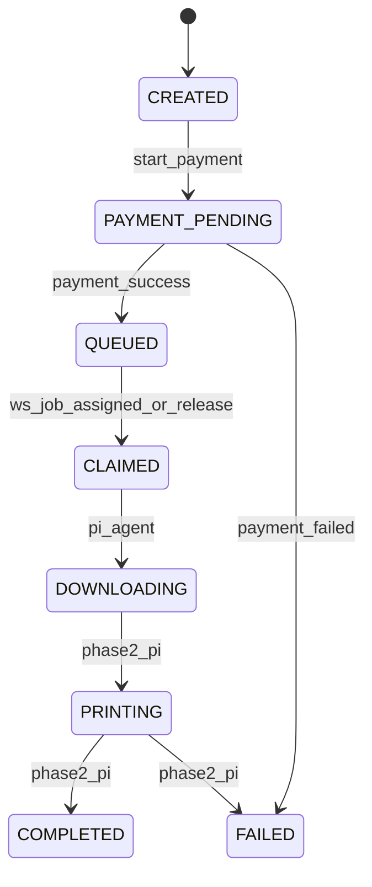

# Print Jobs

## Lifecycle

After payment, jobs enter `QUEUED` and appear on the Scan page ready queue. If the user already has an active kiosk session, the job is bound to that kiosk and may auto-dispatch when the Pi agent is online. Otherwise the user scans the kiosk QR and releases the job manually.

## Events

`print_job_events` append-only timeline. Current status is on `print_jobs.status`.

## Print Settings (Phase 1)

| Setting | Values |
|---------|--------|
| copies | integer ≥ 1 |
| page_range | e.g. `1-5`, `1,3,5`, or `all` |
| color_mode | `BW` (UI); `COLOR` in model for future |
| paper_size | `A4` |
| duplex | `SINGLE`, `DOUBLE` |
| pages_per_sheet | 1, 2, 4, … |
| order | `NORMAL`, `REVERSE` |
| orientation | `AUTO`, `PORTRAIT`, `LANDSCAPE` |
| fit_to_page | boolean |

## Physical Sheet Pricing (authoritative)

1. Count pages in range ⊆ `[1, page_count]`.
2. Logical sheets per copy = `ceil(pages_in_range / pages_per_sheet)`.
3. Physical sheets per copy:
   - Single-sided: = logical sheets
   - Double-sided: `ceil(logical_sheets / 2)`
4. Total physical sheets = physical per copy × copies.
5. Price = physical sheets × rate(color_mode) from `pricing_rules`.

Rates default: B&W ₹2/sheet, Color ₹3/sheet (stored in paise: 200, 300).

## Saved Files

Optional “Save for 30 days” sets `save_file=true` and `file_retention_until=now+30d`. One saved file may back multiple print jobs. Reprint from History only when file still exists.

## Pi agent contract

Pay-first (primary):

- Payment success → `QUEUED` (no `kiosk_id`) → user scans kiosk → `POST /print-jobs/{id}/release` → `kiosk_id` set → backend sends `job.assigned` on `/ws/kiosk` → dispatch sets `CLAIMED` + `dispatched_at`.

Optional scan-before-pay:

- Payment success with active `kiosk_sessions` row → `kiosk_id` bound → auto-dispatch if Pi is online.

Manual release (`POST /print-jobs/{id}/release`):

- Sets `kiosk_id`, keeps `QUEUED` until dispatch; events `KIOSK_SELECTED`; dispatch adds `PRINT_REQUESTED` and transitions to `CLAIMED`.

See [pi-integration.md](./pi-integration.md).

## User-facing status (API)

`GET /print-jobs/:id` returns `display_status`, `display_label`, `display_message`, and `steps[]`. The browser polls every 2s until `is_terminal` is true.

| `display_status` | Label |
|------------------|-------|
| `QUEUED` | Waiting for kiosk |
| `RECEIVED` | Kiosk received your job |
| `DOWNLOADING` | Preparing your file |
| `READY` | Ready to print |
| `PRINTING` | Printing |
| `COMPLETED` | Printed |
| `FAILED` | Print failed |

`pi_phase` on `print_jobs` stores the last Pi-reported phase (`job.received` → `RECEIVED`, `job.ready` → `READY`, etc.) without renaming DB status enums.

## File cleanup

On `COMPLETED`, if `save_file=false`, the backend deletes the source blob immediately (`cleanup_status`). Cleanup failure does not change job status from `COMPLETED`.

## Env

- `JOB_STUCK_TIMEOUT_MINUTES` (default 30)
- `KIOSK_HEARTBEAT_TIMEOUT_SECONDS` (default 90)
